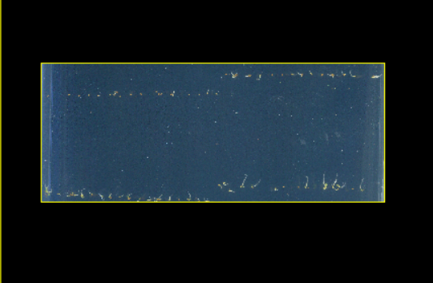
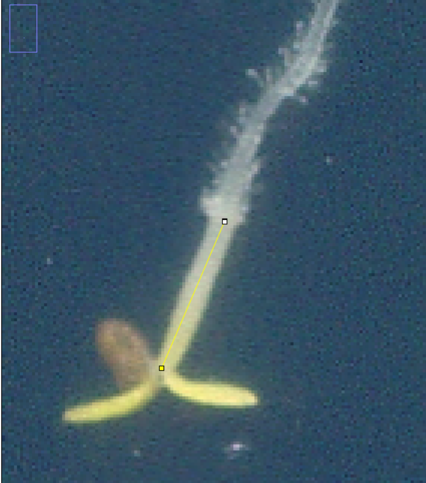

# Using deep learning to measure stem length from images 

This repository is the further applications and improved version for the paper [A deep learning-based approach for high throughput plant phenotyping, 
Dobos et al.](http://www.plantphysiol.org/content/181/4/1415). 

[The image datasets used in the project can be found at this page](https://drive.google.com/drive/folders/1ysAulbQ1Lj0XKlTA5YLSI9xKnl1tPXid?usp=drive_link).

[The previous research pretrained model used in the project can be downloaded here.](https://drive.google.com/open?id=1SlUui64l-k63vxysl0YAflKaECfpj8Rr)
[The final model of this project can be downloaded here.](https://drive.google.com/file/d/1z3pDonZzANgknQZ17vv6HgAUnmmKue3z/view?usp=drive_link)
For details on how to generate training and validation dataset and how to train the model, please refer to the detailed introduction provided in previous research, which can be viewed from the following link.(https://github.com/biomag-lab/hypocotyl-UNet)
## Contents
- [Newly added code in the project](#intro)
- [Method for processing images for measurement](#processing)
- [Method for measuring the true length of plant stems](#measuring)

## Newly added code in the project 
#### train.py:
Basically the same as the initial version
#### measure.py(new version): 
Compared with the initial version, the application of thresholds has been increased, and a complete measurement prediction is performed for each set threshold.
#### draw_roc_total.py: 
This is a code that visualizes the data generated in measure.py, and finally generates a model to identify plants in the data.
#### draw_roc_sameday.py:
This is a code that visualizes the data generated in measure.py. It will eventually generate a model to identify plants in the data. The difference from the above is that the data used is different. The data used here is the plant data of the same day.
#### draw_scatter.py:
This is a code that compares the model's predicted results when measuring plant stem length with the actual stem length, and calculates the corresponding R-squared value and MSE value.
#### bar.py:
This is a code that visualizes the R-squared and MSE values ​​obtained in draw_scatter
#### src/unet/utils.py:
In this code, the metrics for evaluating model performance are expanded to include accuracy, precision, and recall.
#### numerical data:
The data in this folder is used for visualization

## Method for processing images for measurement 
Step 1.Select an appropriate selection tool from ImageJ, for example *Rectangle* and select the part you want to keep.

Step 2.After selecting the selection, click Edit->Selection->Make Inverse to invert the selection.

Step 3.After confirming the inverted selection, click Edit->Cut to remove this part of the selection, and the remaining part is the part that the model wants to predict.

## Method for measuring the true length of plant stems 
Step 1.Open the image in ImageJ and click Analyze->tool to open ROI Manager. Find and click the straight line tool in the selection tool above, right-click and select Segemented Line to anchor the plant stem part in the image (if you encounter a curved part, add an anchor point at the bend)..

Step 2.After completing the anchor point confirmation selection, click Add in the ROI Manager to add the selection.

Step 3.After adding, click Measure in ROI Manager to get the length in pixels, then click File->Save as to save the file locally (if the actual length is needed, use the following formula to convert: millimeters = (pixels * 25.4d) / dpi).

